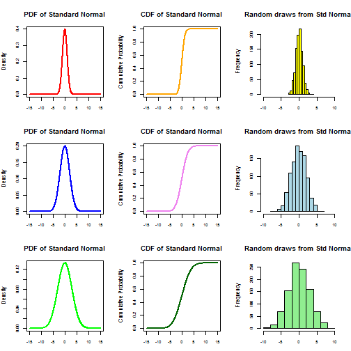

## PROJECT SUMMARY

This is the final presentation for the Course Project of the Coursera 'Developing data products' course

This assignment has two parts: (1) creating a Shiny interactive application and (2) creating the reproducible pitch presentation describing this application.

My Shiny Application is using various inputs to simulating Standard Normal distribution charts with custom parameters 

The Source code for ui.R and server.R files are available on the GitHub repo: https://github.com/aquilaT/9_developing_data_products 

The App is available at Shiny server following the link: https://aquilat.shinyapps.io/shinyapp/ 

This Reproducible Pitch presentation was created using Slidify. 


--- .class #id 

## APP's KEY FUNCTIONALITY

My Web Application functionality:

I developed my Shiny Web application for those students who study Statistics. Visualization of how different statistical distribution functions will change should help students to better visualize and memorize:

1. how major stat charts (PDF, CDF, Random draws from Standard Normal) look like under different parameters
2. how these charts will change if we change major parameters: Mean, Standard 
3. availability of 3 sets of charts on 1 plot allows for better comparison and understanding

Live and interactive visualization of inputs and outputs is an excellent way to deeper learn, "sense" and understand the concept of NORMAL GAUSSIAN DISTRIBUTION CHARTS. 

--- .class #id 

## R CODE ESSENTIALS

My App generates 3 independent sets of major Normal distribution's curves.

INPUT:

- For generating various independent inputs, 3 sets of sliderInput are used
- for each of 3 curves I put 2 variable parameters: STANDARD DEVIATION and MEAN
- ST DEVIATION varies in the range of 1....5 (default values are 1,2,3 for each of 3 curves)
- MEAN can vary in the range -10....+10 (default values is 0 for each of 3 curves)


OUTPUT:

- To generate PDF, CDF, and Random draws I used R functions dnorm(), pnorm(), rnorm()

```r
densities   <- dnorm(x, mean1, sd1)
cumulative <-pnorm(x, mean1, sd1)
randomdeviates <-rnorm(1000, mean1, sd1)
```

--- .class #id 

## RUNNING SIMULATIONS

We can set 6 parameters independently to observe various combinations. The charts with default MEAN and ST DEV parameters look like below:  


